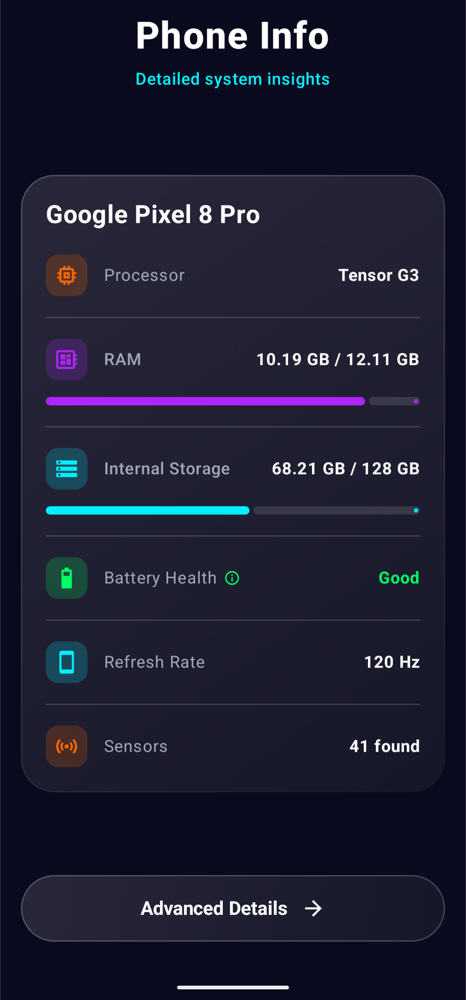
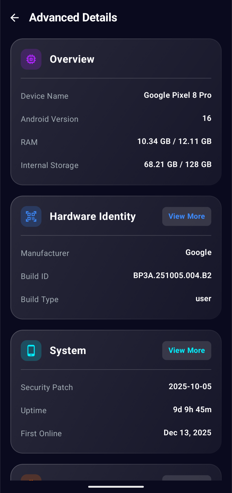
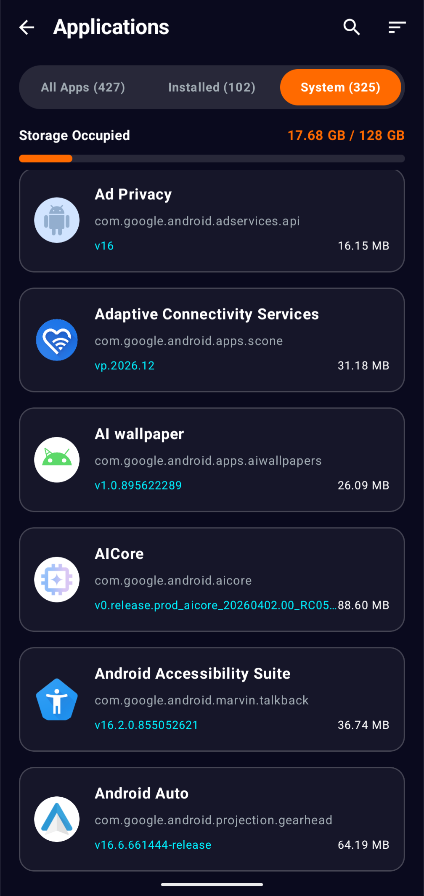

# 📱 PhoneInfo
*Detailed system insights and hardware diagnostics for your Android device.*

---

## 📖 Overview
PhoneInfo is a modern Android utility application designed to provide comprehensive details about your device's hardware and software. Built with a clean, glassmorphic UI using Jetpack Compose, the app surfaces real-time metrics ranging from CPU and memory usage to battery health and sensor availability. It serves as a powerful, professional-grade diagnostic tool to help you understand the exact capabilities and status of your device.

---

## ✨ Features
* **Device Overview (Home Screen):** Quick-glance dashboard showing core metrics like RAM usage, storage availability, CPU name, battery health, and screen refresh rate.
* **Advanced Hardware Diagnostics:** Deep-dive categories for detailed insights:
  * **System & Identity:** OS version, build details, uptime, root status, and bootloader info.
  * **CPU & Memory:** Core counts, architecture, real-time frequencies, VM heap sizes, and RAM thresholds.
  * **Camera Specs:** Resolutions, focal lengths, apertures, and optical stabilization (OIS) support for all available lenses.
  * **Connectivity:** Wi-Fi details (signal strength, IP, MAC, frequency) and Mobile Network info (dual-SIM support, carrier, network type, roaming status).
  * **Battery Analytics:** Real-time charging status, health condition, temperature, voltage, and charging source.
  * **Sensors:** Complete list of all hardware sensors available on the device.
* **Application Management:** Categorized app lists (All, Installed, System) detailing exact storage footprints. Includes sorting capabilities (by Name, Size, Install Date) and search functionality.
* **Internet Speed Test:** Integrated in-app webview to run a secure network speed test (via Speakeasy) directly from the Wi-Fi details card.

---

## 🛠 Tech Stack
* **Language:** Kotlin
* **UI Toolkit:** Jetpack Compose (Material 3 with custom Glassmorphism styling)
* **Architecture:** MVVM (Model-View-ViewModel)
* **State Management:** Kotlin Coroutines & `StateFlow` for real-time background polling
* **Navigation:** Jetpack Navigation Compose
* **System Services & APIs:** `BatteryManager`, `TelephonyManager`, `WifiManager`, `SensorManager`, `CameraManager`, `StorageStatsManager`

---

## 📊 Data Collected / Information Displayed
* **CPU:** Processor name, architecture, core count, supported ABIs, real-time core frequencies, thermal temperature.
* **Memory (RAM):** Total, used, available, low memory threshold, Java VM heap allocation.
* **Storage:** Internal and external (SD Card) capacity and utilization limits.
* **Battery:** Level, health status (e.g., Good, Overheating), temperature (°C), voltage (mV), technology, and charging source (AC/USB/Wireless).
* **Display:** Resolution, physical size (inches), refresh rate (Hz), density (DPI), and font scale.
* **Network:** Wi-Fi SSID, link speed, frequency, IP/MAC addresses, cellular operator, network type (4G/5G), and SIM state.
* **OS & System:** Android version, SDK level, security patch, kernel version, and build fingerprint.

---

## 🏛 Architecture
PhoneInfo is engineered using a clean **MVVM (Model-View-ViewModel)** architecture:
* **View Layer (Compose):** Fully declarative UI utilizing Jetpack Compose. Components observe state changes to update the UI reactively and fluidly.
* **ViewModel (`PhoneInfoViewModel`):** Acts as the central data engine. It manages background coroutines to continuously poll hardware APIs and system files (e.g., `/proc/cpuinfo`, `/sys/class/thermal/`), safely formatting the raw data into presentation-ready `DeviceInfo` state objects via `StateFlow`.
* **Data Models:** Simple, immutable Kotlin data classes (`DeviceInfo`, `AppDetail`, `CameraInfo`, `StorageInfo`) ensure structured and predictable data flow between the system hardware services and the UI.

---

## 📸 Screenshots

<div align="center">
  
  &nbsp;&nbsp;&nbsp;
  
  &nbsp;&nbsp;&nbsp;
  
</div>

---

## ⚙️ Installation Steps
1. **Clone the repository:**
   ```bash
   git clone https://github.com/mudasirunar/PhoneInfo.git
   ```
2. **Open in Android Studio:**
   Launch Android Studio and select `File > Open`, then navigate to the cloned `PhoneInfo` directory.
3. **Sync Project:**
   Allow Android Studio to sync the Gradle build and download necessary dependencies.
4. **Run the App:**
   Connect a physical Android device (highly recommended for accurate hardware/sensor readings) or start an emulator, and click the **Run** button. Note: Some permissions (like Location or Usage Access) will be requested at runtime to display specific details like Wi-Fi SSID or accurate App Sizes.

---

## 🚀 Future Improvements
* **Hardware Diagnostics Testing:** Interactive modules to test screen touch accuracy, speakers, microphone, and the vibration motor.
* **Benchmark Metrics:** Add CPU and GPU stress-testing capabilities to generate device performance scores.
* **Export/Share Device Report:** Ability to export the entire device diagnostic report as a PDF or formatted text file for easy sharing or troubleshooting.
* **Battery Usage History:** Granular graphs showing battery drain over time and estimating long-term battery capacity.
* **More UI Themes:** Expand the current glassmorphic design system with adaptive themes or pure dark/light mode toggles.
